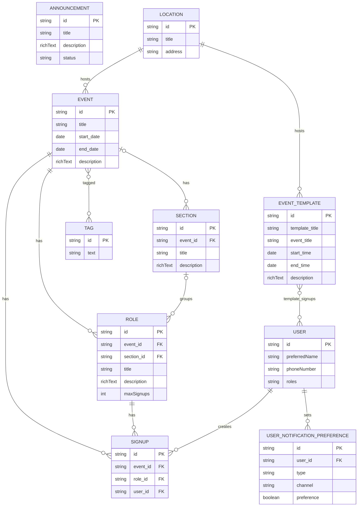

# ER Diagram

```mermaid
erDiagram
    ANNOUNCEMENT {
        string id PK
        string title
        richText description
        string status
    }
    EVENT {
        string id PK
        string title
        date start_date
        date end_date
        richText description
    }
    EVENT_TEMPLATE {
        string id PK
        string template_title
        string event_title
        date start_time
        date end_time
        richText description
    }
    LOCATION {
        string id PK
        string title
        string address
    }
    ROLE {
        string id PK
        string event_id FK
        string section_id FK
        string title
        richText description
        int maxSignups
    }
    SECTION {
        string id PK
        string event_id FK
        string title
        richText description
    }
    SIGNUP {
        string id PK
        string event_id FK
        string role_id FK
        string user_id FK
    }
    TAG {
        string id PK
        string text
    }
    USER {
        string id PK
        string preferredName
        string phoneNumber
        string roles
    }
    USER_NOTIFICATION_PREFERENCE {
        string id PK
        string user_id FK
        string type
        string channel
        boolean preference
    }

    EVENT o|--o{ SECTION : has
    EVENT ||--o{ ROLE : has
    SECTION o|--o{ ROLE : groups
    EVENT ||--o{ SIGNUP : has
    ROLE ||--o{ SIGNUP : has
    USER ||--o{ SIGNUP : creates
    USER ||--o{ USER_NOTIFICATION_PREFERENCE : sets
    EVENT }o--o{ TAG : tagged
    EVENT_TEMPLATE }o--o{ USER : template_signups
    LOCATION ||--o{ EVENT : hosts
    LOCATION ||--o{ EVENT_TEMPLATE : hosts
```
