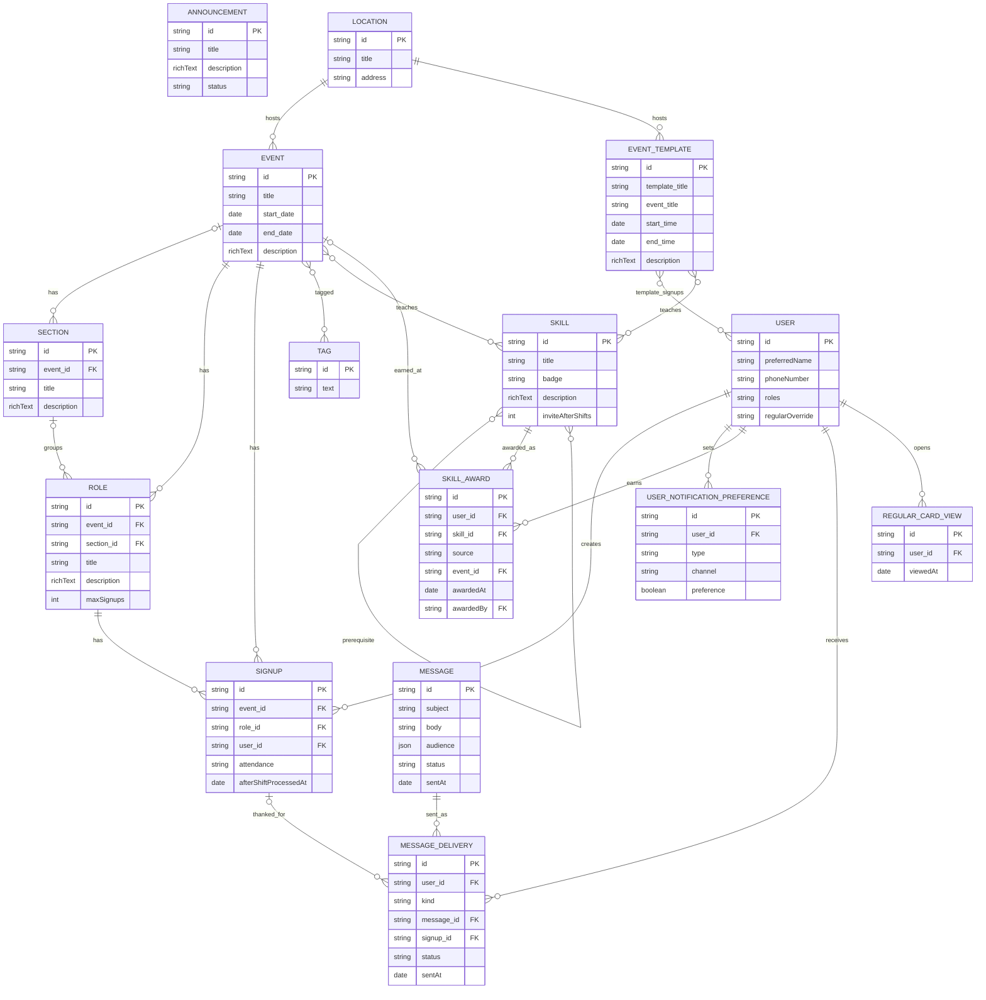

# ER Diagram

```mermaid
erDiagram
    ANNOUNCEMENT {
        string id PK
        string title
        richText description
        string status
    }
    EVENT {
        string id PK
        string title
        date start_date
        date end_date
        richText description
    }
    EVENT_TEMPLATE {
        string id PK
        string template_title
        string event_title
        date start_time
        date end_time
        richText description
    }
    LOCATION {
        string id PK
        string title
        string address
    }
    ROLE {
        string id PK
        string event_id FK
        string section_id FK
        string title
        richText description
        int maxSignups
    }
    SECTION {
        string id PK
        string event_id FK
        string title
        richText description
    }
    SIGNUP {
        string id PK
        string event_id FK
        string role_id FK
        string user_id FK
        string attendance
        date afterShiftProcessedAt
    }
    SKILL {
        string id PK
        string title
        string badge
        richText description
        int inviteAfterShifts
    }
    SKILL_AWARD {
        string id PK
        string user_id FK
        string skill_id FK
        string source
        string event_id FK
        date awardedAt
        string awardedBy FK
    }
    MESSAGE {
        string id PK
        string subject
        string body
        json audience
        string status
        date sentAt
    }
    MESSAGE_DELIVERY {
        string id PK
        string user_id FK
        string kind
        string message_id FK
        string signup_id FK
        string status
        date sentAt
    }
    REGULAR_CARD_VIEW {
        string id PK
        string user_id FK
        date viewedAt
    }
    TAG {
        string id PK
        string text
    }
    USER {
        string id PK
        string preferredName
        string phoneNumber
        string roles
        string regularOverride
    }
    USER_NOTIFICATION_PREFERENCE {
        string id PK
        string user_id FK
        string type
        string channel
        boolean preference
    }

    EVENT o|--o{ SECTION : has
    EVENT ||--o{ ROLE : has
    SECTION o|--o{ ROLE : groups
    EVENT ||--o{ SIGNUP : has
    ROLE ||--o{ SIGNUP : has
    USER ||--o{ SIGNUP : creates
    USER ||--o{ USER_NOTIFICATION_PREFERENCE : sets
    EVENT }o--o{ TAG : tagged
    EVENT_TEMPLATE }o--o{ USER : template_signups
    LOCATION ||--o{ EVENT : hosts
    LOCATION ||--o{ EVENT_TEMPLATE : hosts
    EVENT }o--o{ SKILL : teaches
    EVENT_TEMPLATE }o--o{ SKILL : teaches
    SKILL }o--o{ SKILL : prerequisite
    USER ||--o{ SKILL_AWARD : earns
    SKILL ||--o{ SKILL_AWARD : awarded_as
    EVENT o|--o{ SKILL_AWARD : earned_at
    MESSAGE ||--o{ MESSAGE_DELIVERY : sent_as
    USER ||--o{ MESSAGE_DELIVERY : receives
    SIGNUP o|--o{ MESSAGE_DELIVERY : thanked_for
    USER ||--o{ REGULAR_CARD_VIEW : opens
```

The global `volunteer-settings` (regular rule, perks, shift badges,
thank-you email) is not shown. See
[Volunteer engagement](../explanation/volunteer-engagement.md).
